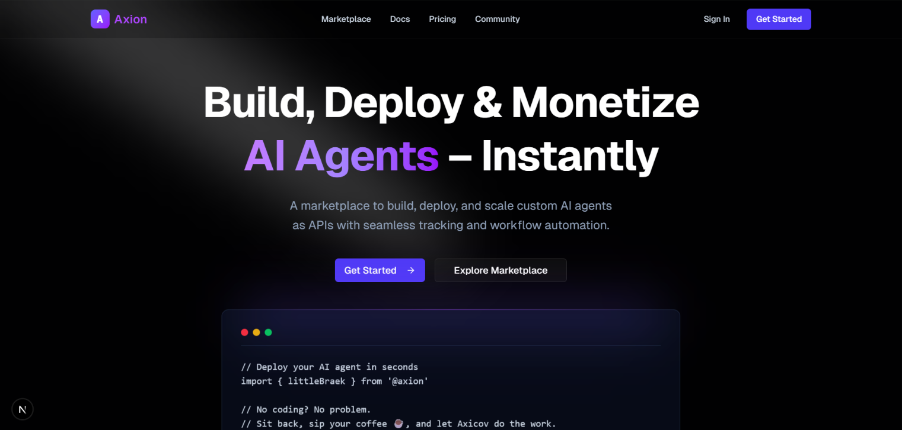

# Axicov – “Sit back, relax… your agents are already working” ⚡☕ 


A no-code platform that empowers developers and businesses to build, deploy, and scale custom AI agents as APIs - all without writing a single line of code. Sit back, sip your coffee ☕, and let Axicov automate your tasks.

## 🌟 Features
- ⚡ Instant Deployment – Launch AI agents with live API endpoints in seconds
- 🔒 Secure Environment – Enterprise-grade security with encrypted variables
- 📊 Usage Analytics – Monitor performance and optimize agents in real time
- 💰 Monetize & Share – Turn agents into revenue streams
- 🛠️ No-Code Builder – Drag, drop, and create custom AI agents effortlessly
- 🔗 Integration Ready – Connect with tools like Slack, Gmail, or CRMs
- 🌍 Scalable Infrastructure – Built to handle growth without extra setup
- 🎨 Templates & Prebuilt Agents – Start fast with ready-to-use blueprints

## 🛠️ Technologies Used
- Next.js – Frontend framework
- TailwindCSS – Styling and responsive UI
- Node.js / Express – Backend APIs
- Axicov SDK – AI agent creation & deployment
- MongoDB / PostgreSQL – Data management
- Docker – Containerized deployment

## ⚙️ Installation

1. Clone the repository:
```bash
git clone https://github.com/BikramMondal5/Axion.git
```
2. Navigate to the project directory:
```bash
cd Axion
```
3. Install dependencies:
```bash
npm install
#or
npm install --legacy-peer-deps
```

4. Run the server:
```bash
npm run dev
```

5. Open your browser and navigate to `http://localhost:3000` to view the app.

## 🚀 How to Use

- ✨ Sign up / Log in to the Axicov dashboard.
- 🛠️ Create a new agent – choose a template or start from scratch.
- 🎛️ Configure your agent – define tasks, tools, and workflow.
- 🚀 Deploy instantly – get a live API endpoint.
- 📊 Monitor usage & analytics from the dashboard.
- 💵 Set pricing & share your agent with the community.

## 🤝 Contribution

**Got ideas? or Found a bug? 🐞**
- Open an issue or submit a pull request — contributions are always welcome!

## 📜 License

This project is licensed under the `Apache-2.0 license`.